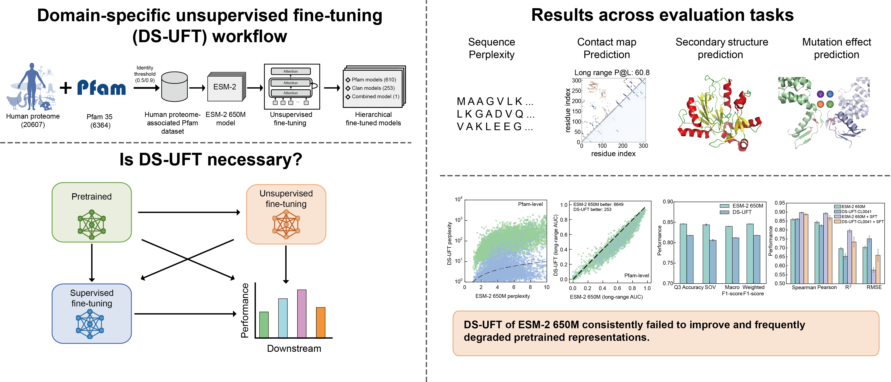

# DS-UFT-Benchmark
Benchmarking domain-specific unsupervised fine-tuning (DS-UFT) for protein language models (PLMs).

## Overview

We have fine-tuned the transformer protein language model, ESM-2, at scales of 650 million parameters, on each Pfam family corresponding to human proteome, respectively.



## Goal

The goal of this work is to build a dedicated and fine-tuned protein language model for each human protein family on top of a general protein language model. This model can be used for functional prediction or other downstream tasks.

Researchers can directly use the protein language model, fine-tuned by the Pfam family belonging to the human protein they are studying, to output the required sequence embeddings for downstream tasks. This operation can be completed directly on CPUs without the need for large-scale GPU computing clusters.

## Quick Start

### Dependencies

As a prerequisite, you must have PyTorch installed to use these models.

Then, install the latest version of fair-esm:

```bash
pip install fair-esm  # latest release, OR
pip install git+https://github.com/facebookresearch/esm.git  # bleeding edge
```

### Download Pretrained Models

Models are available for download from the "Models" section on the top of the page.

You can directly download one model by entering the Pfam or find models associated with specific proteins.

**Notice:** Not all models are available for download. We are working on adding more models.

### Availability and Implementation

Source code for benchmarking and model fine-tuning is freely available on [GitHub](https://github.com/TianBoxue-lab/DS-UFT-Benchmark).

Fine-tuned models generated in this study are publicly available through:
- [Hugging Face](https://huggingface.co/zxcyfr)
- [TianLab Laboratory Website](https://tianlab-tsinghua.cn/en/human-protein-language-models)

### Downstream Tasks

The following code snippet shows how to use the model for downstream tasks.

You can find more examples in the [esm repository](https://github.com/facebookresearch/esm).

```python
import torch
import esm

# Load fine tuned model, the model name must end with ".pt"
model, alphabet = esm.pretrained.load_model_and_alphabet("path/to/downloaded/model.pt")
batch_converter = alphabet.get_batch_converter()
model.eval()  # disables dropout for deterministic results

# Prepare data (first 2 sequences from ESMStructuralSplitDataset superfamily / 4)
data = [
    ("protein1", "MKTVRQERLKSIVRILERSKEPVSGAQLAEELSVSRQVIVQDIAYLRSLGYNIVATPRGYVLAGG"),
    ("protein2", "KALTARQQEVFDLIRDHISQTGMPPTRAEIAQRLGFRSPNAAEEHLKALARKGVIEIVSGASRGIRLLQEE"),
    ("protein2 with mask", "KALTARQQEVFDLIRD<mask>ISQTGMPPTRAEIAQRLGFRSPNAAEEHLKALARKGVIEIVSGASRGIRLLQEE"),
    ("protein3", "K A <mask> I S Q"),
]
batch_labels, batch_strs, batch_tokens = batch_converter(data)
batch_lens = (batch_tokens != alphabet.padding_idx).sum(1)

# Extract per-residue representations (on CPU)
with torch.no_grad():
    results = model(batch_tokens, repr_layers=[33], return_contacts=True)
token_representations = results["representations"][33]

# Generate per-sequence representations via averaging
# NOTE: token 0 is always a beginning-of-sequence token, so the first residue is token 1.
sequence_representations = []
for i, tokens_len in enumerate(batch_lens):
    sequence_representations.append(token_representations[i, 1 : tokens_len - 1].mean(0))
```

## License

This project is licensed under the MIT License - see the [LICENSE](LICENSE) file for details.

**Important:** The demo data and code are provided for academic research and validation purposes.
